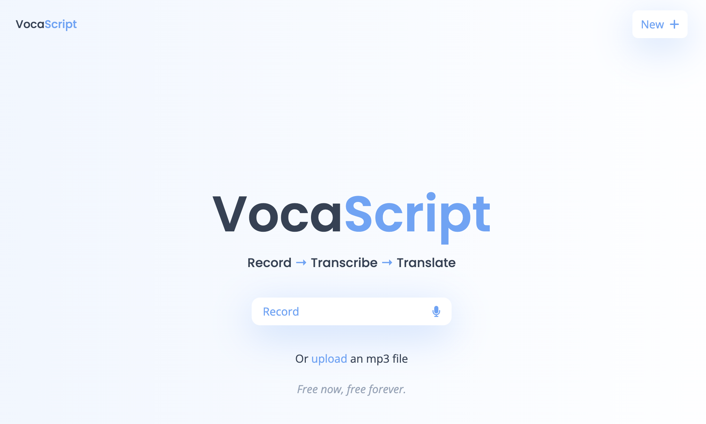

# VocaScript

**VocaScript** is a speech-to-text and translation tool that enables users to transcribe live speech or audio files into text and translate the resulting transcription into any language. This project leverages machine learning models to provide fast and accurate transcription, along with seamless language translation for diverse use cases.

## Features

- **Live Speech Transcription**: Transcribe spoken words in real-time using your device’s microphone.
- **Audio File Upload**: Upload pre-recorded audio files in various formats (.mp3, .wav) for transcription.
- **Multilingual Translation**: Translate transcriptions to any language supported by the translation API, providing a flexible solution for global communication.
- **Accurate & Fast**: Built on state-of-the-art machine learning models (OpenAI Whisper), ensuring high accuracy and quick responses for both transcription and translation tasks.
- **Easy-to-Use Interface**: A clean, user-friendly interface that makes it easy to interact with the app, regardless of technical expertise.

## Tech Stack

- **Frontend**: Built with React & TailwindCSS.
- **Machine Learning**: Utilizes OpenAI’s Whisper model for speech recognition and a translation API for multilingual support.
- **Audio Handling**: Web Audio API for live audio processing and file uploads.

## Usage

1. **Live Transcription**:

- Click the "Record" button to begin recording live speech from your microphone.
- The app will display the transcribed text once the recording has been processed.

2. **Upload an Audio File**:

- Select the "Upload" button to upload an audio file.
- Once the file is processed, the transcription will be shown.

3. **Translate the Transcription**:

- After transcription, select the desired language from the translation dropdown.
- The translated text will appear below the transcription after a brief period.

## License

This project is licensed under the MIT License.
